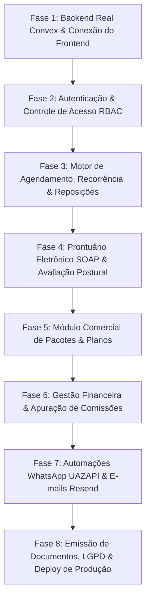

# 📋 Planejamento de Desenvolvimento do Sistema Altar Fisio (Dr. Marcelo)

Este documento estabelece o roteiro técnico, arquitetural e operacional para o desenvolvimento e evolução do sistema **Altar Fisio**, organizando todas as etapas desde o estágio atual (protótipo funcional em mock) até a entrega em produção com backend em tempo real, automações e conformidade regulatória.

---

## 1. Visão Geral do Sistema & Proposta de Valor

O **Altar Fisio** é uma plataforma clínica e de gestão integrada especializada no ecossistema de **Fisioterapia, Studio de Pilates e Reeducação Postural Global (RPG)**.

### Pilares Fundamentais:
1. **Controle Físico e Capacidade de Salas**: Gestão rigorosa de capacidade por ambiente e aparelhos (ex: Studio de Pilates limitado a 4 aparelhos/alunos simultâneos, Sala de RPG com limite de 2 macas, Box de Fisioterapia individual).
2. **Motor de Reposições Inteligente**: Regra de desmarcação com antecedência mínima configurável (ex: 2 horas) que gera automaticamente crédito de reposição com prazo de validade (ex: 30 dias), sem intervenção manual e sem superlotação.
3. **Prontuário Eletrônico Especializado (COFFITO)**: Registro de evolução diária no modelo internacional **SOAP** (Subjetivo, Objetivo, Avaliação, Plano) com assinatura digitalizada e registro CREFITO, biofotogrametria postural (fotos anterior, posterior, lateral) e régua de dor EVA.
4. **Comercial & Controle de Saldos**: Gestão de planos mensais e pacotes de sessões com abatimento automático no check-in do paciente.
5. **Financeiro & Repasse Multidisciplinar**: DRE e fluxo de caixa simplificado com apuração automática de comissões (fixa por atendimento ou percentual) para os fisioterapeutas da equipe.
6. **Automações Omnicanal**: Disparos de confirmação e lembretes 24h/2h via **WhatsApp (UAZAPI)** e envio de comprovantes por **E-mail (Resend)**.

---

## 2. Diagnóstico do Estado Atual (Baseline)

| Camada | Estado Atual | Próximo Passo Necessário |
| :--- | :--- | :--- |
| **Frontend UI** | 100% construído com React 19, Tailwind CSS, Radix UI e Lucide Icons | Manter layout impecável e desacoplar dados mockados |
| **Camada de Dados Frontend** | `ClinicDataContext.tsx` com estado em memória e dados mock estáticos | Substituir por hooks reativos Convex (`useQuery`, `useMutation`) |
| **Backend Schema** | `convex/schema.ts` completamente modelado e indexado | Gerar artefatos de tipo Convex (`_generated`) |
| **Backend Funções** | Endpoints em `convex/*.ts` parcialmente implementados | Implementar ações de negócio pendentes, queries enriquecidas e validações |
| **Autenticação & RBAC** | Inexistente (acesso direto a todas as telas) | Implementar controle de acesso (Admin, Profissional, Recepção) |
| **Armazenamento de Mídia** | URLs mock de imagens nas avaliações posturais | Implementar Convex Storage para upload seguro de fotos clínicas |
| **Automações / Integrações** | Simulação em mock de logs de WhatsApp/Email | Implementar `action` Convex com chamadas HTTP para UAZAPI e Resend |

---

## 3. Arquitetura Técnica & Stack Tecnológica

```
┌───────────────────────────────────────────────────────────────────┐
│                        FRONTEND (SPA)                             │
│       React 19 + TypeScript + Vite + Tailwind CSS + Radix UI       │
└───────────────▲───────────────────────────────────▲───────────────┘
                │                                   │
      Reatividade WebSockets                   HTTP Uploads
                │                                   │
┌───────────────▼───────────────────────────────────▼───────────────┐
│                         CONVEX BACKEND                            │
│  ┌────────────────────────┐         ┌──────────────────────────┐  │
│  │  Queries & Mutations   │ ◄─────► │  Convex File Storage     │  │
│  │  (Transacionais ACID)  │         │  (Fotos Avaliação Post.) │  │
│  └───────────▲────────────┘         └──────────────────────────┘  │
│              │                                                    │
│  ┌───────────▼────────────┐         ┌──────────────────────────┐  │
│  │   Convex Actions       │ ──────► │   Convex Cron Jobs       │  │
│  │   (I/O Assíncrono)     │         │   (Lembretes & Validades)│  │
│  └───────────┬────────────┘         └──────────────────────────┘  │
└──────────────┼────────────────────────────────────────────────────┘
               │
      ┌────────┴────────┐
      │                 │
┌─────▼─────┐     ┌─────▼─────┐
│  UAZAPI   │     │  RESEND   │
│(WhatsApp) │     │ (E-mails) │
└───────────┘     └───────────┘
```

---

## 4. Fases de Desenvolvimento em Etapas



---

### 🟢 FASE 1: Conexão Backend Real Convex & Refatoração do Data Layer
**Objetivo**: Eliminar o mock local e fazer o frontend consumir e persistir dados diretamente no backend em tempo real do Convex.

- [x] **Etapa 1.1**: Conectar o projeto ao ambiente de desenvolvimento do Convex (`npx convex dev`) e gerar os tipos estáticos em `convex/_generated`.
- [x] **Etapa 1.2**: Executar o script de seed inicial (`seedInitialData`) para popular as salas, profissionais, pacientes e configurações no banco Convex.
- [x] **Etapa 1.3**: Configurar o `ConvexProvider` no ponto de entrada da aplicação (`src/main.tsx`).
- [x] **Etapa 1.4**: Refatorar `ClinicDataContext` para agir como uma **Facade Reativa**:
  - Encaminhar chamadas de leitura para `useQuery(api.table.list...)`.
  - Encaminhar chamadas de escrita para `useMutation(api.table.create...)`.
  - Manter a compatibilidade de interface com as telas já construídas (princípio aberto/fechado).

**Critérios de Aceitação (DoD)**:
- Toda alteração em pacientes, salas e agendamentos persiste no banco Convex.
- Duas abas do navegador abertas na mesma tela refletem alterações instantaneamente via WebSocket sem recarregar a página.

---

### 🟢 FASE 2: Autenticação, Perfis de Usuário & Controle de Acesso (RBAC)
**Objetivo**: Garantir que cada usuário (Dr. Marcelo/Admin, Fisioterapeutas e Recepção) veja e execute apenas o que compete ao seu perfil.

- [x] **Etapa 2.1**: Implementar autenticação no Convex (Login com e-mail/senha ou OTP/OAuth).
- [x] **Etapa 2.2**: Vincular a conta de usuário autenticada ao registro da tabela `professionals` ou `staff`.
- [x] **Etapa 2.3**: Definir regras de controle de acesso (RBAC):
  - **Administrador (Dr. Marcelo)**: Acesso total (Financeiro, Comissões, Configurações, Prontuários, Agendas).
  - **Fisioterapeuta / Instrutor**: Acesso à sua própria agenda, check-in de seus alunos e preenchimento de evoluções de prontuário.
  - **Recepção / Secretária**: Acesso ao agendamento geral, cadastro de pacientes, cobranças/recebimentos básicos; restrição de acesso ao prontuário médico confidencial.
- [x] **Etapa 2.4**: Criar tela de Login e proteção de rotas no frontend.

**Critérios de Aceitação (DoD)**:
- Usuário não autenticado é redirecionado para a tela de login.
- Fisioterapeuta não tem visibilidade dos relatórios de DRE global e configurações de API da clínica.
- Prontuário médico fica visível apenas para profissionais de saúde cadastrados com CREFITO.

---

### 🟢 FASE 3: Motor de Agendamento, Recorrência de Turmas e Reposições
**Objetivo**: Robustecer o fluxo diário operacional do estúdio e clínica com prevenção de conflitos físicos de sala e regras automáticas de reposição.

- [x] **Etapa 3.1**: Validador de Capacidade e Conflitos em tempo real:
  - Impedir agendamento que exceda a capacidade física cadastrada na sala (`capacity`).
  - Prevenir conflito de horário para o mesmo profissional e para a mesma sala.
- [x] **Etapa 3.2**: Motor de Turmas Recorrentes de Pilates:
  - Criação de grade semanal recorrente (ex: Turma Segunda e Quarta às 08h durante 6 meses).
  - Geração de instâncias de agendamento no banco respeitando feriados ou pausas.
- [x] **Etapa 3.3**: Automação de Reposição por Desmarcação:
  - Checagem automática do prazo de antecedência configurado (`cancellationNoticeHours`).
  - Se desmarcado antes do limite: gerar registro em `replacementCredits` com expiração de `replacementExpiryDays` (ex: 30 dias).
  - Se desmarcado fora do limite: registrar falta sem crédito (ou com aviso de exceção manual para o gestor).
- [x] **Etapa 3.4**: Interface de Alocação de Reposições:
  - Filtro na agenda por vagas ociosas em turmas do mesmo nível/modalidade.
  - Consumo do crédito e baixa automática no saldo do paciente.

**Critérios de Aceitação (DoD)**:
- Não é possível ultrapassar o limite de 4 alunos na sala de Studio Pilates.
- Paciente que cancela com 3 horas de antecedência recebe crédito com data de expiração de 30 dias.
- Paciente que desmarca em cima da hora não recebe crédito automático.

---

### 🟢 FASE 4: Prontuário Eletrônico SOAP, Biofotogrametria e Avaliação Postural
**Objetivo**: Atender integralmente aos padrões do COFFITO para registro fisioterapêutico seguro, com histórico inalterável e registro de imagens.

- [x] **Etapa 4.1**: Upload e Armazenamento de Imagens Posturais:
  - Implementar upload direto via **Convex File Storage** (`ctx.storage.generateUploadUrl`).
  - Upload de fotos (Vista Anterior, Posterior, Perfil Direito e Perfil Esquerdo) na ficha postural.
  - Exibição de grid com espelho quadriculado de alinhamento postural (biofotogrametria visual).
- [x] **Etapa 4.2**: Evolução Diária no Modelo SOAP:
  - **S (Subjetivo)**: Escuta da queixa do dia, relato de dores/atividades.
  - **O (Objetivo)**: Aparelhos utilizados, molas, repetições, condutas manuais, testes de amplitude.
  - **A (Avaliação)**: Resposta mecânica, dor pós-exercício, compensações posturais.
  - **P (Plano)**: Plano para a sessão seguinte e recomendações domiciliares.
- [x] **Etapa 4.3**: Imutabilidade e Assinatura Legal:
  - Carimbo digital com Data, Hora, Nome do Fisioterapeuta e CREFITO.
  - Trava de edição após finalização da evolução (garantia de integridade exigida pelo conselho profissional).
- [x] **Etapa 4.4**: Gráfico de Evolução da Dor (Escala EVA):
  - Gráfico visual da linha do tempo da dor (EVA de 0 a 10) ao longo das semanas de tratamento.

**Critérios de Aceitação (DoD)**:
- Fisioterapeuta anexa fotos diretamente pela câmera do celular/tablet ou upload de arquivo.
- Cada atendimento gera uma evolução SOAP assinada com registro CREFITO que não pode ser adulterada posteriormente.

---

### 🟢 FASE 5: Módulo Comercial, Planos Recorrentes e Gestão de Saldos
**Objetivo**: Organizar a venda de serviços e pacotes com rastreabilidade completa de sessões contratadas, realizadas e restantes.

- [x] **Etapa 5.1**: Cadastro de Serviços e Pacotes:
  - Modalidades (Pilates 1x, 2x ou 3x na semana; Pacotes de 10 sessões de Fisioterapia; RPG Avulso).
  - Configuração de validade em dias e preço de tabela.
- [x] **Etapa 5.2**: Aquisição de Pacote pelo Paciente (`patientPackages`):
  - Vínculo do pacote ao paciente com cálculo de data inicial e data de expiração.
  - Integração com o módulo financeiro (criação da transação a receber em aberto).
- [x] **Etapa 5.3**: Débito Automático por Check-in:
  - Ao marcar "Presente" na chamada da aula/sessão, decrementar 1 sessão do pacote ativo.
  - Bloqueio ou aviso visual quando o paciente estiver com saldo zerado ou pacote vencido.
- [x] **Etapa 5.4**: Alerta de Renovação Próxima:
  - Listagem de pacientes com 1 ou 2 sessões restantes para ação de retenção/renovação pela equipe.

**Critérios de Aceitação (DoD)**:
- Ao dar presença para o paciente, seu saldo restante é reduzido automaticamente de 8 para 7.
- Paciente sem plano ativo é sinalizado visualmente na lista de presença como "Atendimento Avulso / Pendente".

---

### 🟢 FASE 6: Gestão Financeira Completa & Apuração de Repasses/Comissões
**Objetivo**: Dar clareza financeira ao Dr. Marcelo sobre o fluxo de caixa da clínica e simplificar o fechamento mensal da equipe.

- [x] **Etapa 6.1**: Gestão de Contas a Receber e a Pagar:
  - Lançamento de receitas (mensalidades, pacotes, atendimentos avulsos).
  - Lançamento de despesas da clínica (aluguel, manutenção de reformers/aparelhos, luz, internet, insumos).
  - Status: Pendente, Pago, Atrasado, Cancelado.
- [x] **Etapa 6.2**: Baixa e Conciliação Rápida:
  - Baixa de pagamentos com métodos: PIX, Cartão de Crédito/Débito, Dinheiro, Transferência.
  - Identificação de inadimplentes e valores em aberto no mês corrente.
- [x] **Etapa 6.3**: Motor Automatizado de Comissões dos Profissionais:
  - Leitura de todos os atendimentos com presença confirmada no mês para cada fisioterapeuta.
  - Cálculo de acordo com a regra individual do profissional:
    - **Percentual**: Ex: 50% do valor da sessão/aluno atendido.
    - **Fixo**: Ex: R$ 45,00 por aluno em aula em grupo.
  - Relatório de fechamento com extrato detalhado das aulas ministradas para conferência do profissional.
  - Geração de despesa automática na conta a pagar da clínica após aprovação do fechamento.

**Critérios de Aceitação (DoD)**:
- O painel financeiro exibe o faturamento bruto, custos operacionais e lucro líquido estimado em tempo real.
- O fechamento de comissões calcula com precisão os valores da Dra. Camila e do Dr. Marcelo com base nas presenças reais confirmadas.

---

### 🟢 FASE 7: Motor de Notificações Omnicanal (WhatsApp UAZAPI & E-mail Resend)
**Objetivo**: Reduzir a taxa de "no-show" (faltas não avisadas) e automatizar o envio de recibos e avisos de reposição.

- [x] **Etapa 7.1**: Configuração de Ações Externas Convex (`convex/notifications.ts` via `action`):
  - Integração com a API do **UAZAPI** (instância WhatsApp).
  - Integração com a API do **Resend** (e-mails transacionais com template HTML limpo).
- [x] **Etapa 7.2**: Gatilhos Automatizados:
  - **Lembrete 24h Antes**: Disparado via cron Convex para todos os alunos do dia seguinte com opção de confirmar ou avisar ausência.
  - **Lembrete 2h Antes**: Aviso curto reforçando o horário e orientações de vestimenta (meias antiderrapantes para Pilates).
  - **Aviso de Crédito de Reposição Gerado**: Notificação imediata quando o paciente cancela com antecedência, informando o prazo de validade.
  - **Envio de Recibo Financeiro**: Disparo automático de e-mail ou mensagem com recibo detalhado após confirmação de pagamento.
- [x] **Etapa 7.3**: Painel de Monitoramento de Mensagens:
  - Registro em `notificationLogs` com status de entrega (Enviado, Erro, Em fila) e mensagem de retorno do gateway.

**Critérios de Aceitação (DoD)**:
- Disparo de mensagem de teste com sucesso via endpoint da UAZAPI configurado.
- Cron job Convex executa diariamente identificando os agendamentos das próximas 24 horas e disparando os lembretes.

---

### 🟢 FASE 8: Emissão de Documentos, Conformidade LGPD/COFFITO & Deploy
**Objetivo**: Preparar o sistema para operação oficial com segurança jurídica, geração de documentos em PDF e publicação em alta disponibilidade.

- [x] **Etapa 8.1**: Geração de Documentos em PDF:
  - Recibo de prestação de serviços fisioterapêuticos (com nome do paciente, CPF, valor, CREFITO e assinatura para reembolso de plano de saúde).
  - Atestado de comparecimento e declaração de tratamento fisioterapêutico (com cabeçalho timbrado oficial, datas, horários e CID-10 opcional).
  - Termo de consentimento (TCLE) e ficha de anamnese para assinatura física ou digital.
  - Laudo / Relatório de evolução cinesiológica para encaminhamento a médicos assistentes.
- [x] **Etapa 8.2**: Conformidade e Segurança LGPD:
  - Proteção de dados sensíveis de saúde com URLs assinadas no Convex Storage.
  - Registro imutável de trilha de auditoria (`auditLogs`) para visualizações e alterações de prontuário e emissões de documentos.
  - Gestão de termos de consentimento (`patientConsents`) e visualizador administrativo na tela de configurações.
- [x] **Etapa 8.3**: Otimização de Performance & PWA:
  - Code-splitting dinâmico com `React.lazy` e `Suspense` no `App.tsx` (redução do chunk principal de 650 kB para 325 kB).
  - Suporte completo a instalação como PWA (Progressive Web App) com manifesto `manifest.webmanifest`, Service Worker e meta tags móveis.
- [x] **Etapa 8.4**: Preparação para Deploy na Vercel:
  - Configuração do `vercel.json` com roteamento SPA (`rewrites` para `/index.html`), headers de segurança e cache imutável de assets.
  - Templates de ambiente `.env.example` e documentação passo a passo em `DEPLOY_VERCEL.md`.


---


